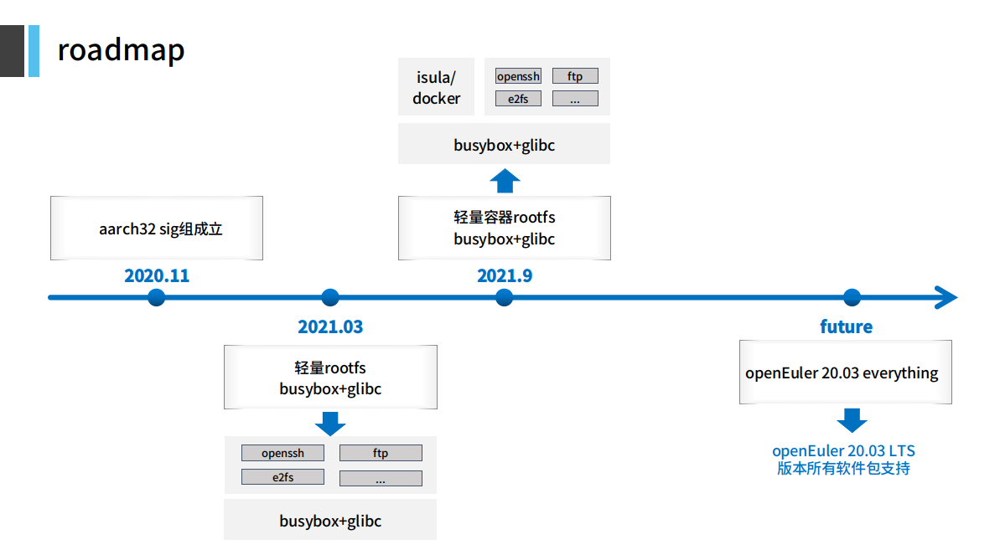

# aarch32-rootfs-builder

#### 介绍
aarch32-rootfs-builder 通过一组工具和补丁实现 openEuler rootfs 相关软件包对 armv7hf 的支持。

#### 工作范围
- 提供 openEuler 常用软件的 arm 32 位的版本
- 开发 openEuler 的 arm 32 版本构建流程脚本
- SRPM 适应 aarm32 架构编译的必要补丁
- 主持 aarch32-sig 相关事宜
- 及时响应用户反馈，解决相关问题

#### 本仓库介绍
```
.
├── conf
│   └── aarch32_support_list.yaml
├── patches
│   ├── gcc_secure
│   │   └── spec
│   │       └── 0001-support-for-arm32-compilation-on-mock.patch
│   └── glibc
│       └── spec
│           └── 0001-add-arm32-support.patch
└── tools
    ├── auto_build_pkgs.sh
    └── rpmmacros_openeuler
```
- conf/aarch32_support_list.yaml 
  - 维护当前支持的 rpm 列表
- patches/*/\* 
  - 存放 rpm 包的 aarch32 支持补丁
- tools/*
  - auto_build_pkgs.sh  自动化编译工具
  - rpmmacros_openeuler 编译所需的 macros 文件

#### 路标

